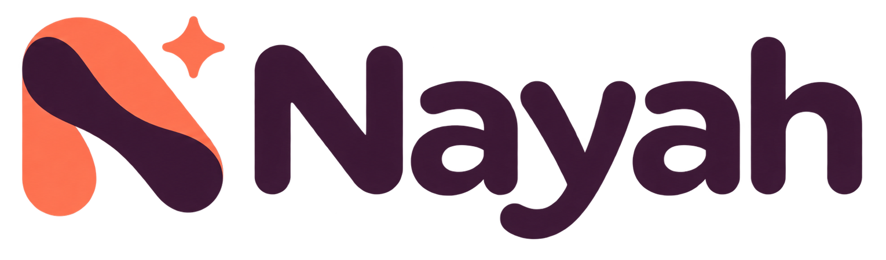

<p align="center">
  
</p>

<p align="center">
  Cooperative family chores and errands, turned into shared quests.
</p>

## About Nayah

Nayah is an Expo mobile prototype that helps families share the work of everyday life. A family member describes a chore or errand, Gemini breaks it into manageable subtasks, and the family can claim and complete those subtasks together.

The app is designed around participation rather than assigning all household coordination to one person.

## What works

- Account creation and login with name, age, and capability roles
- Create a family or join one using a six-character family code
- Persistent local data using Expo SQLite
- AI-generated task breakdowns with full editing before publishing
- Food, cleaning, family, and route quest categories
- Active quest cards with creators, contributors, and live progress
- Subtask claiming, elapsed timers, and capability checks
- Achievement badges based on completed work
- Interactive “Tap into family life” room shortcuts
- Map-pinned drive destinations, foreground location tracking, and automatic arrival completion
- Phone-friendly layouts for Expo Go on iOS and Android

## Tech stack

- React Native and Expo SDK 57
- TypeScript
- Expo SQLite
- Gemini API
- React Native Maps and Expo Location

## Run locally

Requirements:

- Node.js and npm
- Expo Go on an iOS or Android phone
- A Gemini API key

Install dependencies:

```bash
npm install
```

Create a local environment file from the example:

```bash
cp .env.example .env
```

On Windows PowerShell, use:

```powershell
Copy-Item .env.example .env
```

Add your development key to `.env`:

```dotenv
EXPO_PUBLIC_GEMINI_API_KEY=your_api_key_here
EXPO_PUBLIC_GEMINI_MODEL=gemini-2.5-flash
```

Start Expo with a clean cache:

```bash
npx expo start --clear
```

On Windows, `npx.cmd expo start --clear` can be used if PowerShell blocks the `npx` script. Scan the QR code with Expo Go while the computer and phone are on the same network.

## Validation

```bash
npm run typecheck
npm run doctor
```

## Project structure

```text
Screens/       App screens and interaction flows
components/    Shared UI components
services/      SQLite, Gemini, and map/location logic
assets/        Nayah branding and interactive room artwork
App.tsx        App navigation and session coordination
types.ts       Shared TypeScript data models
theme.ts       Colors, spacing, and visual tokens
```

## Prototype limitations

Family accounts and quests currently live in the device-local SQLite database. Family codes therefore connect accounts stored on the same device; a shared backend is required for multiple family phones.

Drive-task arrival detection is foreground-only in Expo Go. Keep the drive screen open, or return to it after external navigation, so the app can detect arrival. Background tracking requires a development build and additional platform permissions.

Variables prefixed with `EXPO_PUBLIC_` are included in the client bundle and are not secrets. The direct Gemini integration is suitable for development only. Before production, move authentication, shared data, and AI requests to a secured backend and rotate the development key.
